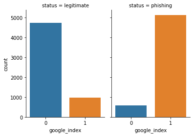
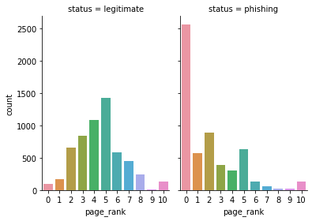

# Model Card

Model cards are a succint approach for documenting the creation, use and
shortcomings of a model. The idea is to write a documentation such as a
non-expert can understand the model card's contents. For additional informnation
about Model Card look the paper: https://arxiv.org/pdf/1810.03993.pdf

## Model Details

Ivanovitch Silva created the model for creating a complete data pipeline using Google Colab, Scikit-Learn and Weights & Bias to train a Decision Tree model. The big-picture of the data pipeline is shown below:

The hyperparameter-tunning was conducted useind a Random Sweep fo WandB and the parameters adopted in train were:

* full_pipeline__num_pipeline__num_transformer__model": 2
* classifier__criterion": 'gini'
* "classifier__splitter": 'random'
* "classifier__random_state": 57

## Intended Use

This Model is used as a proof of concept fot he evaluation of an entire pipeline incorporating Machine Learning fundamentals. The data pipeline is composed of the following steps:

1. [Fetch Data](../source/creating_model/01_fetch_data.ipynb)
2. [EDA](../source/creating_model/02_eda.ipynb)
3. [Preprocessing](../source/creating_model/03_preprocessing.ipynb)
4. [Data Check](../source/creating_model/04_check_data.ipynb)
5. [Data Segregation](../source/creating_model/05_data_segregation.ipynb)
6. [Train](../source/creating_model/06_train.ipynb)
7. [Test](../source/creating_model/07_test.ipynb)

## Training Data

The dataset used in this project is available [Mendeley Data - Web page phishing detection](https://data.mendeley.com/datasets/c2gw7fy2j4/3). The dataset was designed to be used as benchmark for machine learning bases phishing detection systems. Feature are from three different classes:

* 56 extracted from the structure and syntax of URLs;
* 24 extracted from the content of their correspondent pages; and
* 7 are extracted by querying external services.

All features on dataset are numeric. After the EDA we found variables `google_index` and `page_rank` to be important on classifying data.

## Evaluation Data

The dataset under study was splited into Train and Test in the [data segregation step](../source/creating_model/05_data_segregation.ipynb):
* 70% of the clean data is used to Train;
* 30% is used to test.

30% of the Train data is used for validation puposes (hyperparameter-tunning).

## Metrics

In order to follow the perfomance of machine learning experiments, the project markes certains stage of the data pipeline as metrics. The metrics adopted are:
* [accuracy](https://scikit-learn.org/stable/modules/generated/sklearn.metrics.accuracy_score.html);
* [f1](https://scikit-learn.org/stable/modules/generated/sklearn.metrics.f1_score.html#sklearn.metrics.f1_score);
* [precision](https://scikit-learn.org/stable/modules/generated/sklearn.metrics.precision_score.html#sklearn.metrics.precision_score); and
* [recall](https://scikit-learn.org/stable/modules/generated/sklearn.metrics.recall_score.html#sklearn.metrics.recall_score).

We got the followin results:

| Run | Accuracy | F1 | Precision | Recall |
| --- | --- | --- | --- | --- |
|Train [treasured-thunder-35](https://wandb.ai/lupamedeiros/phishing-detection/runs/a8l45v31) | 0.9402 | 0.9403 | 0.9383 | 0.9424 |
| Test [soltar-star-36](https://wandb.ai/lupamedeiros/phishing-detection/runs/1kkb10ej) | 0.9225 | 0.9226 | 0.9214 | 0.9238 |

## Ethical Considerations

The set of attributes used to predict if a url is potentially a phishing was defined by the authors in [Web page phishing detection](https://data.mendeley.com/datasets/c2gw7fy2j4/3). The dataset was constructed on May 2020. The dataset may not represent all the needed data to define if a website is a phishing scam or not.

## Caveats and Recommendations

It should be noted that the model trained in this project was used only for validation of a complete data pipeline. It is notary that some imporvements on the hyperparameters adjust might be useful.